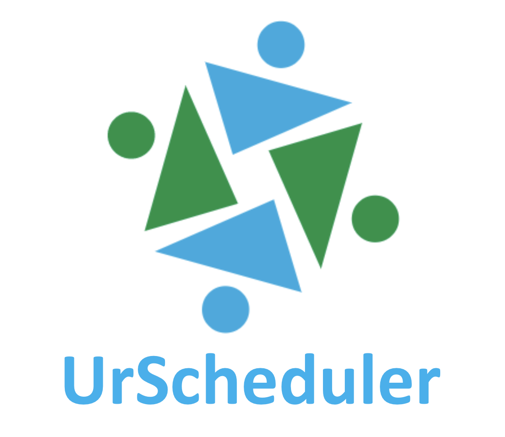

## Table of Contents
- [Introduction](#introduction)
- [Spring Boot](#spring-boot)
- [MongoDB](#mongodb)
- [Thymeleaf](#thymeleaf)
- [Security](#security)
- [Run](#run)
- [Useful Resources](#useful-resources)

## Introduction   
In modern days, people are spending more and more time in different meetings in both formal and casual settings. However, the process of setting up a meeting via phone call or email is usually time-consuming and inefficient. That’s where our web application, UrScheduler, comes into play. Using the UrScheduler web application, meetings can be easily set up by simply clicking a link.   

## Spring Boot  
We are using [Spring Boot](https://projects.spring.io/spring-boot/) framework for this application, which is built by [Maven](https://maven.apache.org/). When using Maven, it is easy to manage dependencies for Java Project. There are totally three dependencies we are using right now:   
- Web  
Full-stack web development with Tomcat and Spring MVC

- MongoDB  
MongoDB NoSQL Database, including spring-data-mongodb

- Thymeleaf  
Thymeleaf templating engine, including integration with Spring  

- Security  
Secure your application via spring-security

The scaffold of this application is built by [Spring Initializr](https://start.spring.io/). In the directory, `models` folder contains models `controllers` contains all the controllers. The `repositories` folder contains interfaces in charge of interaction between controllers and mongodb. The front-end views are stored at `src/main/resources/templates`. And the url routing is set in controller. The dependencies will be set up in `pom.xml`. When a HTTP request is received, it will be dispatched and sent to a method in controller layer and after interaction with database, the controller will indicate the corresponding html file for rendering the view and return a model which contains the contents shown on the html page. In our application, Thymeleaf will be used for rendering the webpage.

## MongoDB  
For this application, [MongoDB](https://www.mongodb.com/), a NoSQL Database is used. It provides much more flexibility compared to relational database. And the collections is the database are:  
- `users`: `{id, username, password, email}`  
- `groups`: `{id, name, groupCreator, members}`  
- `meetings`: `{id, startTime, endTime, message, contact, scheduleType, meetingPrototype, invitee, status}`  
Term explained:  
`scheduleType`: binary int to indicate the origin of this meeting. 1 for meeting setup by non-register users. 0 for register users.
`status`: ternary int to indicate the status of one meeting. 0 for pending, 1 for accepted, 2 for rejected   
- `meetingType`: `{id, name, location, instruction, slots, url, creator}`  

## Thymeleaf  
Thymeleaf is a Java XML/XHTML/HTML5 template engine that can work both in web and non-web environments. One major effect of importing Thymeleaf in our applications is that we will use `.html` file for front-end views instead of `.jsp` file. The difference and more information is quoted as following:  
>Traditionally, Spring MVC applications used Java Server Pages, or JSPs to generate html content. JSPs are a mature technology and has been around since the early days of Java. In terms of raw speed, JSPs are hard to beat too. But when you do not need the absolute raw speed of a JSP, you may want to consider alternatives to JSPs which help improve developer productivity.
>
>JSPs offer an HTML ‘like’ syntax. Meaning its close, but not completely compatible with HTML. Thymeleaf on the other hand, aims to be a “Natural Template”. This means the Thymeleaf template file will open and display normally in a browser, while a JSP file does not.  

## Security
Security is the dependency used for user authentication. Currently, our application uses spring-security 5. One thing about spring-security 5 is that it requires that all passwords stored needs to be **encoded**. So we import `BCryptPasswordEncoder` to do the encoding job for us.

## Run   
To run the application, one needs to first download the project (which is a maven project). Both `Maven` and `MongoDB` can be easily installed via `Homebrew` on a Mac Machine. For simplicity, mongodb should be launched prior to the launch of our application. To do so, just do `mongod` command. If one has a preferable IDE (`Eclipse` or `Intellij`), he will need to import this project. To launch the application, one can run the main java file `MeetingManagerApplication`. Or he can run `mvn spring-boot:run` command under the **root directory** of the application. Finally, open `http://localhost:8080` on the browser. If successful, there should be some prompt like `connection accepted from <some IP Address>` and `received client metadata from <some IP Address>` in the mongodb console, meaning that the application is connected to the local mongodb.

## Useful Resources  
- [Spring: A Head Start](https://medium.com/omarelgabrys-blog/spring-a-head-start-introduction-part-1-130aa1b41e47)  
This blog thoroughly introduces Spring Framewrok, along with an example of web application on Spring Boot. Since it uses `.jsp` files for views, there is some inconsistency between this example and our application. Thus this blog is only for reference of basic concept of Spring and a deep understanding on this is not required.   

- [Spring Boot Web Application – PART 1 – Spring Initializr](https://springframework.guru/spring-boot-web-application-part-1-spring-initializr/)  
This post provides an example of using Spring Initializr. Therefore, although this example uses a relational database, it has a similar hierarchical directory to that of our application. It does elide some details but they can be found by following the links in the post.  

- [Spring Boot Web Application – PART 2 – Using Thymeleaf](https://springframework.guru/spring-boot-web-application-part-2-using-thymeleaf/)  
It is the part 2 of the post above, mainly discussing the use of Thymeleaf.

- [spring-mvc-thymeleaf](https://github.com/pmendelski/spring-mvc-thymeleaf/tree/master/src/main/webapp/WEB-INF/templates/layout)  
This is a GitHub repository which shows how to make a template web page using Thymeleaf.

- [Spring Data, Spring Boot, MongoDB (Example & Tutorial)](https://tests4geeks.com/spring-data-boot-mongodb-example/)   
This is a simple example of implementation of MongoDB on Spring Boot. Although there is some bug within the code, it is quite comprehensive and learning this example helps a lot in understanding our application.

- [MongoDB Tutorial](https://www.youtube.com/watch?v=-0X8mr6Q8Ew&t=)   
This is a YouTube video of introduction of MongoDB itself. So nothing related Spring Boot will be mentioned in this video.

- [Spring Data MongoDB - Reference Documentation](https://docs.spring.io/spring-data/mongodb/docs/current/reference/html/)  
This is the official reference documentation pubished by Spring. It discusses how to manage MongoDB under Spring Framework.

- [Object Mapping with Spring Data Mongodb](https://lishman.io/object-mapping-with-spring-data-mongodb)  
This article explicitly explains how to map Java objects to MongoDB documents (in MongoDB, a table is known as `collection` and an entry/row is known as `document`).

- [Top 10 jQuery Calendar and DatePicker Plugins](https://javabeat.net/top-10-jquery-calendar-datepicker-plugins/)  
This is a post with some nice Calendar/DatePicker Plugins. Among 10 of them, No. 2 and No. 3 have been included into our repository but haven't been added into the view yet.

- [Markdown Cheatsheet](https://github.com/adam-p/markdown-here/wiki/Markdown-Cheatsheet)  
This is a CheatSheet for writing Markdown file.

- [Markdown Documentation](https://docs.gitlab.com/ee/user/markdown.html)
This is the official documentation of Markdown file for GitLab.

